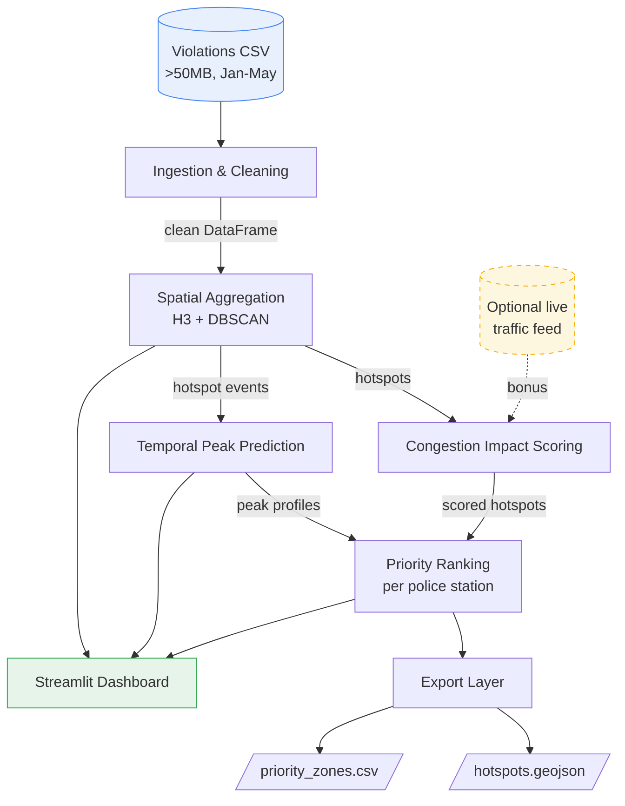
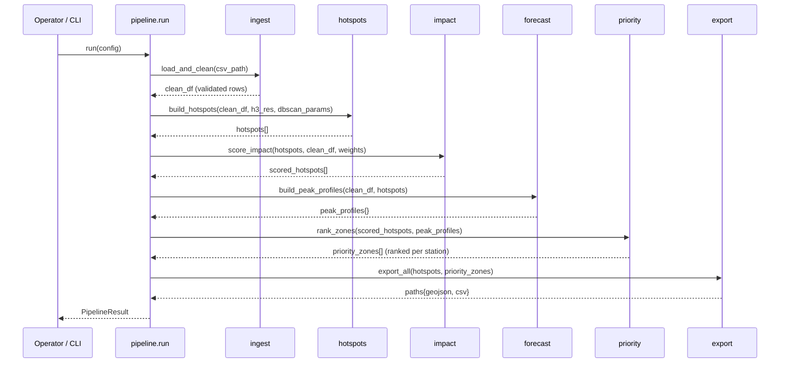
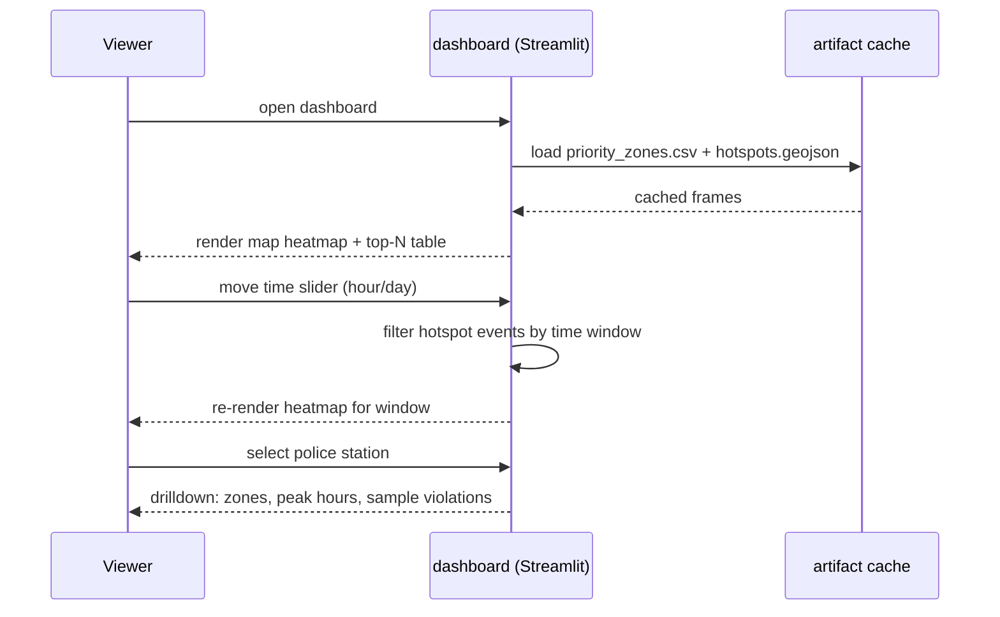

# Design Document: Parking Intelligence

## Overview

Parking Intelligence is an offline-friendly, AI-driven analytics system that turns raw
Bengaluru traffic-police parking-violation records into a prioritized, map-based enforcement
plan. It ingests and cleans a large violation CSV (Jan–May, anonymized), detects illegal
parking hotspots through spatial aggregation (H3 hexagons + DBSCAN), quantifies each hotspot's
impact on traffic flow with a transparent congestion-impact score, and ranks enforcement zones
per police station using an explainable priority formula (impact × frequency × persistence ×
recency). A temporal model forecasts when each hotspot peaks (by hour-of-day and day-of-week)
so patrols can be scheduled proactively rather than reactively.

The system is built for a live hackathon demo: every component runs locally with no required
API keys or network calls, so the demo cannot be blocked by connectivity. An interactive
Streamlit dashboard renders a violation heatmap, a time slider, the top-N priority zones, and a
per-station drilldown. The pipeline also emits two portable artifacts — `hotspots.geojson` and
`priority_zones.csv` — that enforcement teams or downstream GIS tools can consume directly.

The design favors deterministic, inspectable scoring over opaque models. Every number a city
official sees (why a zone ranks #1) can be traced back to component sub-scores, which is
essential for trust in an enforcement context. Optional live traffic-data integration is
designed as a pluggable bonus that augments — but is never required by — the impact score.

## Architecture



The pipeline is a one-directional data flow split into pure, independently testable stages.
Each stage consumes a well-defined DataFrame/object and produces the next. A thin orchestrator
(`pipeline.run`) wires the stages and caches intermediate results so the dashboard can reload
quickly. The dashboard reads pre-computed artifacts rather than recomputing on every interaction.

### Layered responsibilities

| Layer | Module | Responsibility |
|-------|--------|----------------|
| Ingestion | `ingest.py` | Read CSV in chunks, parse JSON-array fields, parse timestamps, validate geo |
| Aggregation | `hotspots.py` | Assign H3 cells, run DBSCAN, build hotspot records |
| Scoring | `impact.py` | Compute per-hotspot congestion-impact score from weighted factors |
| Ranking | `priority.py` | Combine impact, frequency, persistence, recency; rank per station |
| Forecasting | `forecast.py` | Build hour/day peak profiles and predict next peak windows |
| Export | `export.py` | Emit `hotspots.geojson` and `priority_zones.csv` |
| Presentation | `dashboard.py` | Streamlit UI: heatmap, time slider, top-N, drilldown |
| Orchestration | `pipeline.py` | Wire stages, cache intermediate artifacts |

## Sequence Diagrams

### Main pipeline (batch build)



### Dashboard interaction



## Components and Interfaces

### Component 1: Ingestion & Cleaning (`ingest.py`)

**Purpose**: Convert the raw >50MB CSV into a clean, typed, geo-validated DataFrame. Handles
the messy realities of the data: JSON-array string fields (`violation_type`, `offence_code`),
multiple timestamp columns, missing/invalid coordinates, and Bengaluru bounding-box filtering.

**Interface**:
```python
class Ingestor:
    def load_and_clean(self, csv_path: str, *, chunksize: int = 100_000) -> pd.DataFrame: ...
    def parse_json_array(self, raw: str | float) -> list: ...
    def parse_timestamps(self, df: pd.DataFrame) -> pd.DataFrame: ...
    def validate_geo(self, df: pd.DataFrame) -> pd.DataFrame: ...
```

**Responsibilities**:
- Stream the CSV in chunks to keep memory bounded for the >50MB file.
- Parse `violation_type` and `offence_code` JSON arrays into Python lists (tolerating
  malformed/empty values).
- Parse `created_datetime`, `closed_datetime`, etc. into timezone-aware datetimes.
- Drop or flag rows with missing/out-of-range coordinates (outside Bengaluru bbox).
- Normalize categorical fields (`vehicle_type`, `police_station`, `violation_type` tokens).

### Component 2: Spatial Aggregation (`hotspots.py`)

**Purpose**: Group individual violation points into spatial hotspots using two complementary
methods: H3 hexagonal binning (uniform, fast, good for heatmaps) and DBSCAN density clustering
(adaptive, captures organically shaped clusters along carriageways).

**Interface**:
```python
class HotspotBuilder:
    def assign_h3(self, df: pd.DataFrame, resolution: int = 9) -> pd.DataFrame: ...
    def cluster_dbscan(self, df: pd.DataFrame, *, eps_m: float = 75.0,
                       min_samples: int = 15) -> pd.DataFrame: ...
    def build_hotspots(self, df: pd.DataFrame, *, h3_res: int = 9,
                       eps_m: float = 75.0, min_samples: int = 15) -> list[Hotspot]: ...
```

**Responsibilities**:
- Assign each violation an H3 cell index at a configurable resolution.
- Run DBSCAN on haversine-projected coordinates to find dense clusters.
- Reconcile both views into `Hotspot` records with centroid, member count, and bounds.

### Component 3: Congestion Impact Scoring (`impact.py`)

**Purpose**: Quantify how much each hotspot harms traffic flow, combining proximity to
junctions/road crossings, severity of violation types (carriageway-blocking weighted higher),
recurrence, and temporal concentration into a single 0–100 impact score.

**Interface**:
```python
class ImpactScorer:
    def severity_weight(self, violation_types: list[str]) -> float: ...
    def proximity_factor(self, hotspot: Hotspot, df: pd.DataFrame) -> float: ...
    def temporal_concentration(self, events: pd.DataFrame) -> float: ...
    def score_impact(self, hotspots: list[Hotspot], df: pd.DataFrame,
                     weights: ImpactWeights) -> list[ScoredHotspot]: ...
```

**Responsibilities**:
- Map violation-type tokens to severity weights (e.g. blocking a road crossing > a quiet lane).
- Boost hotspots near junctions (`junction_name` present / road-crossing violation tokens).
- Measure how concentrated violations are in time (a spike is worse than uniform spread).
- Produce a normalized, explainable impact score plus its component breakdown.

### Component 4: Priority Ranking (`priority.py`)

**Purpose**: Combine impact with frequency, persistence (how many distinct days it recurs),
and recency into a transparent priority score, then rank zones globally and within each
police station for actionable enforcement allocation.

**Interface**:
```python
class PriorityRanker:
    def frequency_score(self, hotspot: ScoredHotspot) -> float: ...
    def persistence_score(self, events: pd.DataFrame) -> float: ...
    def recency_score(self, events: pd.DataFrame, *, as_of: datetime) -> float: ...
    def rank_zones(self, scored: list[ScoredHotspot],
                   profiles: dict[str, PeakProfile]) -> list[PriorityZone]: ...
```

**Responsibilities**:
- Normalize each factor to 0–1 across the dataset.
- Compute `priority = impact × frequency × persistence × recency` (weighted geometric blend).
- Assign global rank and per-`police_station` rank.
- Attach the peak window from the forecaster for patrol scheduling.

### Component 5: Temporal Peak Prediction (`forecast.py`)

**Purpose**: Learn each hotspot's temporal signature and forecast when it peaks so patrols are
scheduled before violations occur.

**Interface**:
```python
class PeakForecaster:
    def build_peak_profiles(self, df: pd.DataFrame,
                            hotspots: list[Hotspot]) -> dict[str, PeakProfile]: ...
    def predict_next_peaks(self, profile: PeakProfile, *, top_k: int = 3) -> list[PeakWindow]: ...
```

**Responsibilities**:
- Build an hour-of-day × day-of-week histogram per hotspot.
- Smooth sparse cells and identify recurring peak windows.
- Output ranked `PeakWindow`s (day, hour-range, expected intensity).

### Component 6: Export Layer (`export.py`)

**Purpose**: Serialize results into portable, standards-compliant artifacts.

**Interface**:
```python
class Exporter:
    def to_geojson(self, hotspots: list[ScoredHotspot], path: str) -> str: ...
    def to_priority_csv(self, zones: list[PriorityZone], path: str) -> str: ...
    def export_all(self, hotspots: list[ScoredHotspot],
                   zones: list[PriorityZone], out_dir: str) -> dict[str, str]: ...
```

### Component 7: Dashboard (`dashboard.py`)

**Purpose**: Streamlit UI presenting the heatmap, time slider, top-N priority zones, and
per-station drilldown using pydeck/folium for map rendering.

**Interface**:
```python
def render_dashboard(artifacts_dir: str) -> None: ...
def render_heatmap(hotspots_gdf, time_window: TimeWindow | None) -> "Deck": ...
def render_station_drilldown(zones_df, station: str) -> None: ...
```

## Data Models

### Model 1: ViolationRecord (cleaned row)

```python
@dataclass(frozen=True)
class ViolationRecord:
    id: str
    latitude: float                # validated within Bengaluru bbox
    longitude: float
    location: str | None
    vehicle_type: str | None       # normalized lowercase token
    violation_types: list[str]     # parsed from JSON array, upper-cased tokens
    offence_codes: list[int]       # parsed from JSON array
    created_at: datetime           # tz-aware (Asia/Kolkata)
    closed_at: datetime | None
    police_station: str | None
    junction_name: str | None
    center_code: str | None
    validation_status: str | None
```

**Validation Rules**:
- `latitude ∈ [12.7, 13.2]`, `longitude ∈ [77.3, 77.9]` (Bengaluru bbox); else row dropped.
- `violation_types` defaults to `[]` when source is null/malformed.
- `offence_codes` defaults to `[]`; non-integer tokens discarded.
- `created_at` is required; rows without a parseable `created_datetime` are dropped.

### Model 2: Hotspot

```python
@dataclass(frozen=True)
class Hotspot:
    hotspot_id: str                # stable id, e.g. h3 cell or "dbscan-<n>"
    centroid_lat: float
    centroid_lon: float
    h3_cell: str | None
    cluster_label: int | None      # -1 == DBSCAN noise (excluded from hotspots)
    member_count: int              # number of violations in the hotspot
    police_station: str | None     # modal station for member violations
    member_ids: list[str]
```

**Validation Rules**:
- `member_count ≥ min_samples` for DBSCAN-derived hotspots.
- Centroid is the mean of member coordinates (or H3 cell center).
- `cluster_label == -1` (noise) is never emitted as a hotspot.

### Model 3: ScoredHotspot

```python
@dataclass(frozen=True)
class ScoredHotspot:
    hotspot: Hotspot
    impact_score: float            # 0..100
    severity_component: float      # 0..1
    proximity_component: float     # 0..1
    concentration_component: float # 0..1
    breakdown: dict[str, float]    # explainability: factor -> contribution
```

### Model 4: PriorityZone

```python
@dataclass(frozen=True)
class PriorityZone:
    hotspot_id: str
    centroid_lat: float
    centroid_lon: float
    police_station: str | None
    impact: float                  # 0..1 normalized
    frequency: float               # 0..1
    persistence: float             # 0..1
    recency: float                 # 0..1
    priority_score: float          # 0..100
    global_rank: int               # 1 == highest priority
    station_rank: int              # rank within its police_station
    peak_windows: list[PeakWindow]
```

### Model 5: PeakProfile & PeakWindow

```python
@dataclass(frozen=True)
class PeakProfile:
    hotspot_id: str
    hour_dow_matrix: list[list[float]]   # 7 x 24 normalized intensity
    total_events: int

@dataclass(frozen=True)
class PeakWindow:
    day_of_week: int               # 0 == Monday
    start_hour: int                # 0..23
    end_hour: int                  # inclusive, 0..23
    expected_intensity: float      # 0..1 relative to hotspot max
```

### Model 6: Config objects

```python
@dataclass(frozen=True)
class ImpactWeights:
    w_severity: float = 0.45
    w_proximity: float = 0.35
    w_concentration: float = 0.20   # must sum to 1.0

@dataclass(frozen=True)
class PriorityConfig:
    as_of: datetime                 # reference "now" for recency
    recency_halflife_days: float = 21.0
```

## Algorithmic Pseudocode

### Algorithm 1: Ingest & Clean

```python
def load_and_clean(csv_path, chunksize=100_000):
    cleaned_chunks = []
    for chunk in read_csv_chunks(csv_path, chunksize):
        # ASSERT: chunk has all expected source columns
        chunk = parse_json_fields(chunk)          # violation_type, offence_code -> lists
        chunk = parse_timestamps(chunk)           # *_datetime -> tz-aware datetime
        chunk = validate_geo(chunk)               # drop out-of-bbox / null coords
        chunk = normalize_categoricals(chunk)     # lowercase vehicle_type, trim station
        chunk = chunk.dropna(subset=["created_at", "latitude", "longitude"])
        cleaned_chunks.append(chunk)
    df = concat(cleaned_chunks)
    df = df.drop_duplicates(subset=["id"])        # idempotent on re-ingest
    # ASSERT: every row has valid lat/lon and created_at
    return df
```

**Preconditions:**
- `csv_path` points to a readable CSV containing the documented source columns.
- `chunksize > 0`.

**Postconditions:**
- Every returned row has coordinates within the Bengaluru bbox and a tz-aware `created_at`.
- `violation_types` and `offence_codes` are Python lists (possibly empty), never raw strings.
- No duplicate `id` values remain.

**Loop Invariant:**
- After processing chunk *k*, `cleaned_chunks` contains only validated rows from the first *k*
  chunks; no invalid row is ever appended.

### Algorithm 2: Build Hotspots (H3 + DBSCAN)

```python
def build_hotspots(df, h3_res=9, eps_m=75.0, min_samples=15):
    df = assign_h3(df, resolution=h3_res)                 # adds 'h3_cell'
    coords_rad = radians(df[["latitude", "longitude"]].to_numpy())
    eps_rad = eps_m / EARTH_RADIUS_M                      # convert metres -> radians
    labels = DBSCAN(eps=eps_rad, min_samples=min_samples,
                    metric="haversine").fit_predict(coords_rad)
    df["cluster_label"] = labels

    hotspots = []
    for label, group in df.groupby("cluster_label"):
        if label == -1:                                  # DBSCAN noise
            continue
        # ASSERT: len(group) >= min_samples
        hotspots.append(Hotspot(
            hotspot_id=f"dbscan-{label}",
            centroid_lat=group.latitude.mean(),
            centroid_lon=group.longitude.mean(),
            h3_cell=mode(group.h3_cell),
            cluster_label=int(label),
            member_count=len(group),
            police_station=mode(group.police_station),
            member_ids=group.id.tolist(),
        ))
    return hotspots
```

**Preconditions:**
- `df` is the cleaned output of `load_and_clean` (valid coordinates guaranteed).
- `eps_m > 0`, `min_samples ≥ 1`, `0 ≤ h3_res ≤ 15`.

**Postconditions:**
- Every emitted `Hotspot` has `member_count ≥ min_samples` and `cluster_label ≠ -1`.
- Each input row belongs to at most one emitted hotspot (DBSCAN partitions points).
- Noise points (`label == -1`) are excluded from output.

**Loop Invariant:**
- For each processed group, all members share the same `cluster_label`, and the running
  `hotspots` list contains only non-noise clusters seen so far.

### Algorithm 3: Congestion Impact Score

```python
def score_impact(hotspots, df, weights):
    raw_scores = []
    for hs in hotspots:
        events = df[df.id.isin(hs.member_ids)]
        sev  = severity_weight(flatten(events.violation_types))   # 0..1
        prox = proximity_factor(hs, events)                       # 0..1
        conc = temporal_concentration(events)                     # 0..1
        raw = (weights.w_severity * sev
             + weights.w_proximity * prox
             + weights.w_concentration * conc)                    # 0..1
        raw_scores.append((hs, raw, sev, prox, conc))

    max_raw = max((r for _, r, *_ in raw_scores), default=1.0) or 1.0
    scored = []
    for hs, raw, sev, prox, conc in raw_scores:
        impact = 100.0 * (raw / max_raw)                          # normalize to 0..100
        scored.append(ScoredHotspot(hs, impact, sev, prox, conc,
                                    breakdown={"severity": sev, "proximity": prox,
                                               "concentration": conc}))
    return scored
```

**Impact factor definitions:**

- **Severity** `sev` — max severity weight among the hotspot's violation tokens, where
  carriageway/road-crossing-blocking types carry the highest weight:

```math
sev = \max_{t \in T}\; \sigma(t), \quad \sigma: \text{token} \rightarrow [0,1]
```

  Example weight table (configurable): `PARKING NEAR ROAD CROSSING = 1.0`,
  `WRONG PARKING ON CARRIAGEWAY = 0.9`, `WRONG PARKING = 0.6`, `NO PARKING ZONE = 0.5`.

- **Proximity** `prox` — fraction of events tied to a junction or road-crossing context:

```math
prox = \frac{|\{e : e.junction\_name \neq \emptyset \;\lor\; \text{crossing\_token}(e)\}|}{|events|}
```

- **Temporal concentration** `conc` — `1 − normalized entropy` of the hour-of-day
  distribution; a hotspot whose violations cluster into few hours scores higher than one
  spread uniformly:

```math
conc = 1 - \frac{H(p)}{\log_2 24}, \qquad H(p) = -\sum_{h=0}^{23} p_h \log_2 p_h
```

**Preconditions:**
- `weights.w_severity + weights.w_proximity + weights.w_concentration = 1.0`.
- Each hotspot's `member_ids` exist in `df`.

**Postconditions:**
- Every `impact_score ∈ [0, 100]`; the highest-raw hotspot scores exactly 100.
- `breakdown` components are each in `[0, 1]` and reconstruct the raw score under `weights`.

### Algorithm 4: Priority Ranking

```python
def rank_zones(scored, profiles, config):
    # 1. Compute raw per-factor values
    rows = []
    for s in scored:
        events = events_for(s.hotspot)
        freq = s.hotspot.member_count                          # raw count
        pers = events.created_at.dt.date.nunique()             # distinct active days
        rec  = recency_decay(events.created_at.max(), config)  # 0..1 (exp half-life)
        rows.append((s, freq, pers, rec))

    # 2. Min-max normalize freq & pers to 0..1 across all hotspots
    freq_n = minmax([f for _, f, _, _ in rows])
    pers_n = minmax([p for _, _, p, _ in rows])

    zones = []
    for (s, freq, pers, rec), fn, pn in zip(rows, freq_n, pers_n):
        impact_n = s.impact_score / 100.0
        # weighted geometric mean -> a near-zero factor sinks the score (AND-like)
        priority = 100.0 * geomean([impact_n, fn, pn, rec],
                                   weights=[0.4, 0.25, 0.2, 0.15])
        zones.append(make_zone(s, impact_n, fn, pn, rec, priority,
                               peak_windows=predict_next_peaks(profiles[s.hotspot.hotspot_id])))

    # 3. Global + per-station ranking
    zones.sort(key=lambda z: z.priority_score, reverse=True)
    assign_global_rank(zones)
    for station, grp in group_by_station(zones):
        assign_station_rank(grp)
    return zones
```

```math
priority = 100 \times \prod_{i} f_i^{\,w_i}, \quad
f \in \{impact, freq, pers, rec\}, \quad \sum_i w_i = 1
```

```math
recency = 2^{-\Delta d / H}, \quad \Delta d = (as\_of - last\_event).days, \quad H = \text{half-life}
```

**Preconditions:**
- `scored` is non-empty; each hotspot has a matching entry in `profiles`.
- `config.recency_halflife_days > 0`.

**Postconditions:**
- Every `priority_score ∈ [0, 100]`.
- `global_rank` is a strict ordering: ranks are `1..N` with no gaps; rank 1 has the max score.
- Within each `police_station`, `station_rank` is `1..M` ordered by `priority_score`.
- Using a geometric mean, any factor equal to 0 forces `priority_score = 0`.

**Loop Invariant:**
- During normalization, each appended normalized value lies in `[0, 1]`.

### Algorithm 5: Temporal Peak Prediction

```python
def build_peak_profiles(df, hotspots):
    profiles = {}
    for hs in hotspots:
        events = df[df.id.isin(hs.member_ids)]
        M = zeros(7, 24)                          # day-of-week x hour
        for e in events.itertuples():
            M[e.created_at.weekday()][e.created_at.hour] += 1
        M = laplace_smooth(M, alpha=0.5)          # avoid zero cells on sparse hotspots
        M = M / M.max()                           # normalize to 0..1
        profiles[hs.hotspot_id] = PeakProfile(hs.hotspot_id, M.tolist(), len(events))
    return profiles

def predict_next_peaks(profile, top_k=3):
    cells = [(dow, h, profile.hour_dow_matrix[dow][h])
             for dow in range(7) for h in range(24)]
    cells.sort(key=lambda c: c[2], reverse=True)
    windows = merge_adjacent_hours(cells[:top_k])  # coalesce contiguous peak hours
    return [PeakWindow(dow, s, e, intensity) for (dow, s, e, intensity) in windows]
```

**Preconditions:**
- Each hotspot has `≥ 1` member event with a valid `created_at`.
- `top_k ≥ 1`.

**Postconditions:**
- Each `PeakProfile.hour_dow_matrix` is `7 × 24` with values in `[0, 1]` and max value `1.0`.
- `predict_next_peaks` returns at most `top_k` windows, each with `0 ≤ start_hour ≤ end_hour ≤ 23`.

## Key Functions with Formal Specifications

### parse_json_array()

```python
def parse_json_array(raw: str | float) -> list: ...
```

**Preconditions:** `raw` is a JSON-array string (e.g. `'["WRONG PARKING"]'`), `None`, or `NaN`.
**Postconditions:** Returns a `list`; malformed/empty/NaN input yields `[]`; never raises.

### validate_geo()

```python
def validate_geo(df: pd.DataFrame) -> pd.DataFrame: ...
```

**Preconditions:** `df` has numeric-coercible `latitude`/`longitude` columns.
**Postconditions:** Output contains only rows with coordinates inside the Bengaluru bbox;
`len(output) ≤ len(df)`; no NaN coordinates remain.

### severity_weight()

```python
def severity_weight(violation_types: list[str]) -> float: ...
```

**Preconditions:** `violation_types` is a list of normalized tokens (possibly empty).
**Postconditions:** Returns a value in `[0, 1]`; empty list returns the configured floor (e.g. `0.3`);
result equals the max σ over recognized tokens.

### recency_decay()

```python
def recency_decay(last_event: datetime, config: PriorityConfig) -> float: ...
```

**Preconditions:** `last_event ≤ config.as_of`; `config.recency_halflife_days > 0`.
**Postconditions:** Returns a value in `(0, 1]`; equals `1.0` when `last_event == as_of`;
strictly decreasing in elapsed days.

## Example Usage

```python
from parking_intelligence import pipeline
from parking_intelligence.models import ImpactWeights, PriorityConfig
from datetime import datetime, timezone

# Example 1: Full batch build with defaults
result = pipeline.run(
    csv_path=r"jan to may police violation_anonymized791b166.csv",
    out_dir="artifacts/",
)
print(result.geojson_path)        # artifacts/hotspots.geojson
print(result.priority_csv_path)   # artifacts/priority_zones.csv

# Example 2: Custom impact weighting (emphasize carriageway severity)
weights = ImpactWeights(w_severity=0.6, w_proximity=0.3, w_concentration=0.1)
result = pipeline.run(
    csv_path="violations.csv", out_dir="artifacts/",
    impact_weights=weights,
    priority_config=PriorityConfig(as_of=datetime(2024, 6, 1, tzinfo=timezone.utc)),
    h3_res=10, dbscan_eps_m=60.0, min_samples=20,
)

# Example 3: Top enforcement zones for one station
top_for_station = [z for z in result.priority_zones
                   if z.police_station == "Indiranagar" and z.station_rank <= 5]
for z in top_for_station:
    peak = z.peak_windows[0]
    print(f"#{z.station_rank} score={z.priority_score:.1f} "
          f"peak=DOW{peak.day_of_week} {peak.start_hour}-{peak.end_hour}h")

# Example 4: Launch the dashboard (run from terminal, not inline)
#   streamlit run parking_intelligence/dashboard.py -- --artifacts artifacts/
```

## Correctness Properties

These properties hold for all valid inputs and are the basis for property-based tests:

### Property 1: Geo validity
∀ row `r` in `load_and_clean(csv)`:
`12.7 ≤ r.latitude ≤ 13.2 ∧ 77.3 ≤ r.longitude ≤ 77.9 ∧ r.created_at ≠ null`.

### Property 2: JSON parse totality
∀ inputs `x`: `parse_json_array(x)` returns a `list` and never raises; non-array input ⟹ `[]`.

### Property 3: Hotspot minimality
∀ hotspot `h` in `build_hotspots(df, …, min_samples=k)`:
`h.member_count ≥ k ∧ h.cluster_label ≠ -1`.

### Property 4: Partition
∀ violation `v`: `v` belongs to at most one DBSCAN hotspot.

### Property 5: Impact bounds
∀ scored hotspot `s`: `0 ≤ s.impact_score ≤ 100`, and `max_s s.impact_score = 100` when ≥1 hotspot exists.

### Property 6: Priority bounds and ordering
∀ zone `z`: `0 ≤ z.priority_score ≤ 100`; global ranks form a contiguous permutation `1..N`
consistent with descending `priority_score`.

### Property 7: Zero-factor annihilation
If any of `{impact, frequency, persistence, recency}` is 0 for a zone, then `priority_score = 0`
(geometric-mean property).

### Property 8: Recency monotonicity
For fixed `as_of`, `recency_decay` is non-increasing in elapsed days and equals `1.0` at zero
elapsed days.

### Property 9: Peak profile normalization
∀ profile `p`: `hour_dow_matrix` is `7×24`, all values in `[0,1]`, with maximum exactly `1.0`.

### Property 10: Determinism
Given identical inputs and config (and fixed DBSCAN/random seeds), the pipeline produces
byte-identical `priority_zones.csv` ordering.

## Error Handling

### Scenario 1: Malformed JSON-array field
**Condition:** `violation_type`/`offence_code` cell is empty, `NaN`, or not valid JSON.
**Response:** `parse_json_array` returns `[]` and the row is retained.
**Recovery:** Severity defaults to the configured floor; row still contributes to spatial counts.

### Scenario 2: Invalid / missing coordinates
**Condition:** `latitude`/`longitude` is null, non-numeric, or outside the Bengaluru bbox.
**Response:** Row dropped in `validate_geo`; count logged to an ingestion report.
**Recovery:** Pipeline continues with valid rows; dropped-row count surfaced in the dashboard.

### Scenario 3: No clusters found
**Condition:** DBSCAN labels every point as noise (sparse data or strict params).
**Response:** `build_hotspots` returns `[]`; pipeline falls back to H3-cell aggregation as hotspots.
**Recovery:** Dashboard shows H3 heatmap; a warning recommends relaxing `eps_m`/`min_samples`.

### Scenario 4: Unparseable timestamps
**Condition:** `created_datetime` cannot be parsed for a row.
**Response:** Row dropped (created_at is required); other timestamp columns tolerate nulls.
**Recovery:** Logged; does not abort the run.

### Scenario 5: Memory pressure on large CSV
**Condition:** File too large to load at once.
**Response:** Chunked reading (`chunksize`) keeps memory bounded; dtypes downcast where safe.
**Recovery:** Operator can lower `chunksize`; pipeline streams without full materialization until concat.

## Testing Strategy

### Unit Testing Approach
- Pure functions (`parse_json_array`, `severity_weight`, `recency_decay`, `temporal_concentration`)
  tested with table-driven cases including empty/malformed inputs and boundary coordinates.
- `validate_geo` tested against bbox edges (just inside/outside).
- Forecasting tested on synthetic events with a known injected peak hour.

### Property-Based Testing Approach
Properties 1–10 above are encoded as generative tests: synthesize random violation DataFrames
(random coords, vehicle types, JSON arrays, timestamps) and assert invariants hold.

**Property Test Library:** `hypothesis` (Python).

Example targets:
- `parse_json_array` totality (never raises, always returns list).
- Impact/priority score bounds `[0,100]`.
- Rank contiguity and ordering.
- Geometric-mean zero-annihilation.

### Integration Testing Approach
- End-to-end `pipeline.run` on a small fixture CSV (~1k rows) asserting that `hotspots.geojson`
  is valid GeoJSON and `priority_zones.csv` has expected columns and contiguous ranks.
- Golden-file determinism test: same input + seed ⟹ identical CSV ordering.

## Performance Considerations
- CSV (>50MB) read in chunks; coordinates stored as `float32`, categoricals as `category` dtype.
- DBSCAN on haversine metric runs on radian coordinate arrays; for very large N, pre-bin by H3
  cell and cluster per-cell-neighborhood to bound complexity.
- Dashboard reads pre-computed artifacts and uses Streamlit `@st.cache_data` so slider/drilldown
  interactions never recompute the pipeline.
- Heatmap rendering uses aggregated H3 cells (not raw points) to keep the map responsive.

## Security Considerations
- Data is already anonymized; `vehicle_number`/`updated_vehicle_number` are treated as opaque and
  excluded from exports and the dashboard to avoid re-identification.
- No PII is written to `hotspots.geojson` or `priority_zones.csv` (only aggregates and locations).
- Fully offline by default — no API keys, no outbound calls — so the demo cannot be blocked and no
  data leaves the machine. Optional external traffic integration is opt-in and clearly isolated.

## Dependencies
- **Core:** Python 3.10+, `pandas`, `numpy`
- **Spatial:** `h3`, `scikit-learn` (DBSCAN), `shapely`/`geojson` (export)
- **Forecasting:** `numpy` (histogram/smoothing); `scikit-learn` optional for refinement
- **Dashboard:** `streamlit`, `pydeck` (primary) / `folium` (fallback)
- **Testing:** `pytest`, `hypothesis`
- **Optional bonus:** external live traffic-data connector (pluggable, not required)
